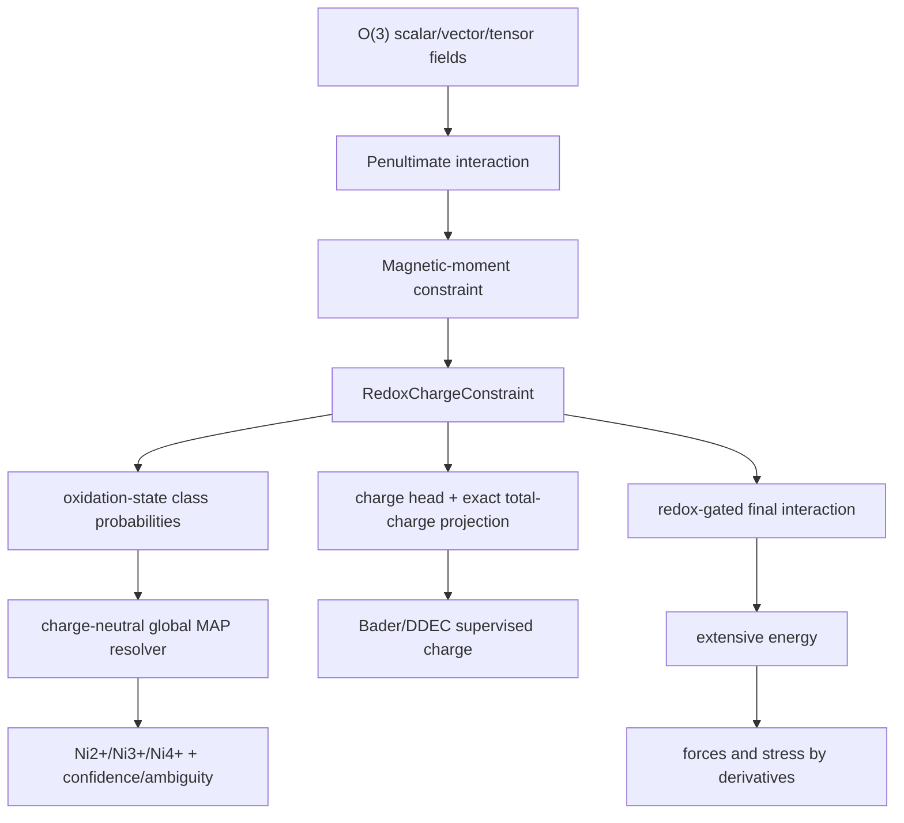
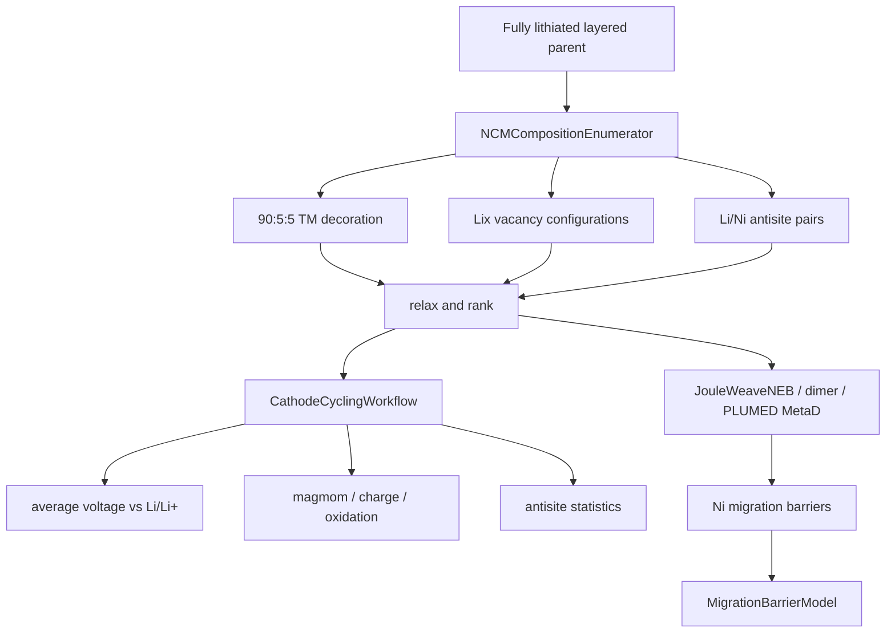
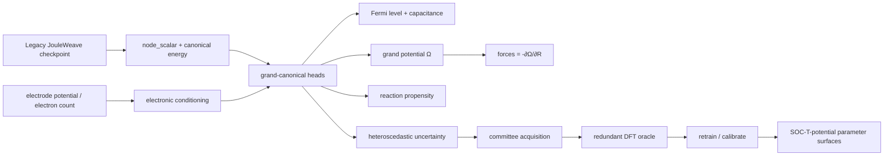

# JouleWeave redox and rare-event extension

The projected partition charges sum exactly to the graph total charge. Only the
unprojected local charge latent gates the final interaction, so the learned
energy remains local and usable through the domain-decomposed ML-IAP path.

Bader basin populations are not oxidation states. `read_bader_acf` therefore
requires the exact pseudopotential valence-electron counts and never substitutes
atomic number. `OxidationStateResolver.resolve_ncm` combines the trained
oxidation-state probabilities, optional charge calibration, explicit NCM
chemistry assumptions, and global charge neutrality. `is_unique=True` is
reported only when the best assignment is sufficiently separated from the next
feasible assignment and every selected site passes its confidence threshold.

For a 90:5:5 NCM90 composition, use a parent with a multiple of 20 transition
metal sites. Voltage references must be evaluated with the same checkpoint and
energy convention as the cathode structures.

## Grand-canonical electrochemical extension

`ConstantPotentialJouleWeave` wraps, rather than replaces, the original model.
Consequently a canonical checkpoint remains loadable and its original outputs
remain available.  The wrapper adds graph-level electrode-potential and
charge-state conditioning, a learned Fermi-level matching residual, bounded
electron response, differential capacitance, grand potential, atom-level
reaction channels, and calibrated uncertainty.  A potential trained on
reactive constant-potential DFT trajectories can therefore drive dynamics using
the grand potential while retaining the original energy/force/stress pathway.

The implementation is an architecture and training/orchestration layer.  It
does not bundle a pretrained universal electrochemical checkpoint or a DFT
executable.  `DFTOracle` adapters must call the user's validated electronic-
structure workflow, and chemistry is only reliable inside the training and
active-learning domain.
